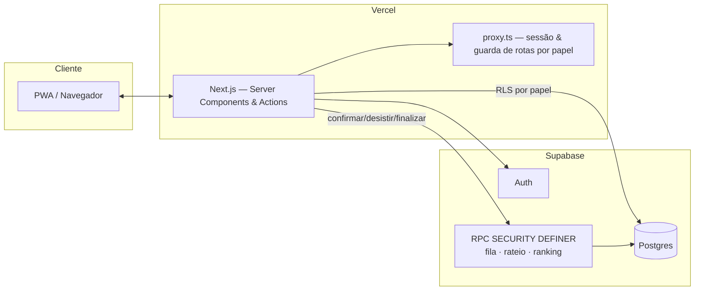
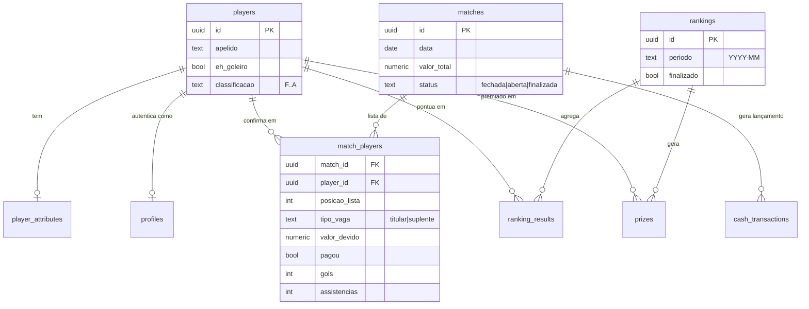

<div align="center">


# Resenha F.C

**Gestão completa de um racha de futebol semanal** — presença, fila de suplentes, rateio automático, gols e assistências, ranking mensal com pódio, premiação e caixa transparente.

[](https://nextjs.org)
[](https://www.typescriptlang.org)
[](https://tailwindcss.com)
[](https://supabase.com)
[](https://web.dev/progressive-web-apps/)

</div>

---

## Sobre o projeto

Todo grupo que joga uma pelada semanal enfrenta o mesmo caos: confirmação de presença espalhada no WhatsApp, ninguém sabe se sobrou vaga ou virou suplente, alguém sempre esquece de pagar e o saldo do caixa vive incerto. O **Resenha F.C** resolve isso com um fluxo único: o jogador confirma presença pelo celular, o sistema controla automaticamente titulares/suplentes (2 goleiros + 15 linha), divide o valor da quadra em tempo real entre quem confirmou, registra gols/assistências e fecha um ranking mensal com pódio e premiação — tudo com controle de acesso por papel (administrador, moderador, jogador).

Construído como estudo de caso de uma aplicação **multi-tenant de regras de negócio concorrentes** (duas pessoas confirmando presença ao mesmo tempo não podem furar a fila) resolvidas no banco, não no frontend.

## Funcionalidades

- 🔐 **Autenticação por apelido** — login simples (nome/apelido + senha), sem exigir e-mail, com 3 papéis (admin, moderador, jogador) e RBAC via Row Level Security do Postgres.
- 📋 **Fila inteligente** — 2 vagas de goleiro + 15 de linha; ao lotar, novas confirmações viram suplentes automaticamente; se um titular desiste, o próximo suplente compatível (goleiro só é trocado por goleiro) sobe sozinho.
- 💰 **Rateio dinâmico** — o valor da quadra é dividido em tempo real pelo número de jogadores de linha confirmados (goleiro não paga) e só "congela" quando a lista fecha.
- ⚽ **Gols, assistências e presença** por racha, com histórico acumulado por jogador.
- 🏆 **Ranking mensal + pódio** — pontuação calculada automaticamente, com premiação (1 racha grátis) para o Top 3 e controle de uso do benefício.
- ⭐ **Classificação F → A** por jogador, com atributos (drible, finalização, velocidade etc.) editáveis pelo administrador.
- 💵 **Caixa transparente** — histórico de entradas/saídas visível a todos, com saldo sempre atualizado.
- 📱 **PWA instalável** — funciona offline-first e pode ser adicionado à tela inicial no Android e iOS.

## Stack

| Camada | Tecnologia |
|---|---|
| Framework | Next.js 16 (App Router, Server Actions, Server Components) |
| Linguagem | TypeScript (strict) |
| Estilo | Tailwind CSS v4 |
| Banco de dados | PostgreSQL (Supabase) |
| Autenticação | Supabase Auth + RLS |
| Regras de negócio | Funções Postgres `SECURITY DEFINER` (evitam condição de corrida na fila) |
| Deploy | Vercel + Supabase (free tier) |
| PWA | Web App Manifest + Service Worker |

## Arquitetura



A UI nunca decide sozinha se alguém vira titular ou suplente, nem recalcula o rateio — ela apenas chama funções de banco (`confirmar_presenca`, `desistir_presenca`, `finalizar_lista`, `finalizar_ranking`) que fazem a leitura e escrita de forma atômica. Isso elimina condição de corrida quando dois jogadores confirmam ao mesmo tempo, e mantém a regra de negócio em **um único lugar**, reutilizável por qualquer client futuro (app nativo, bot de WhatsApp etc.).

### Modelo de dados



## Decisões de projeto

A especificação original deixava alguns pontos de negócio em aberto — decisões tomadas e o porquê:

- **Login por apelido, não e-mail.** Supabase Auth exige e-mail; cada perfil recebe um e-mail interno sintético (`apelido@resenhafc.internal`, ver [`lib/auth/roles.ts`](src/lib/auth/roles.ts)). O jogador só digita nome/apelido e senha — nunca vê esse detalhe.
- **Rateio recalculado em tempo real.** Em vez de um valor fixo por jogador, o total da quadra é redividido a cada confirmação/desistência (`recalcular_valores`) e só é congelado quando a lista fecha — assim quem confirma cedo já vê o valor mais próximo do real.
- **Fila e suplência via função de banco, não via frontend.** `confirmar_presenca`/`desistir_presenca` rodam com `SECURITY DEFINER` para serem atômicas: a checagem de vaga disponível e a escrita acontecem na mesma transação.
- **Pontuação e classificação centralizadas.** Pesos e faixas ficam em [`lib/business/scoring.ts`](src/lib/business/scoring.ts) e [`classification.ts`](src/lib/business/classification.ts) — ajustar o peso de um gol não exige tocar em nenhuma tela.
- **`proxy.ts` em vez de `middleware.ts`.** No Next.js 16 o arquivo de middleware foi renomeado para Proxy — a guarda de sessão e RBAC por rota vive em [`src/proxy.ts`](src/proxy.ts).
- **Senha temporária em vez de "1234" fixo.** O Supabase Auth exige mínimo de 6 caracteres, então o cadastro gera uma senha de 6 dígitos exibida uma única vez pra quem cadastrou; o `proxy.ts` obriga o jogador a criar sua própria senha em `/trocar-senha` antes de acessar qualquer outra tela.

## Estrutura de pastas

```
resenha-fc/
├─ src/
│  ├─ app/
│  │  ├─ login/                 # autenticação (Server Action)
│  │  └─ (app)/                 # rotas autenticadas
│  │     ├─ dashboard/
│  │     ├─ racha/              # fila, confirmação, gols/pagamentos
│  │     ├─ ranking/            # pódio e histórico
│  │     ├─ jogadores/[id]/     # perfil, habilidades, premiações
│  │     ├─ caixa/
│  │     └─ admin/usuarios/     # cadastro de jogadores/moderadores
│  ├─ components/{layout,pwa}/
│  ├─ lib/
│  │  ├─ supabase/{client,server,admin}.ts
│  │  ├─ business/{scoring,classification,racha}.ts
│  │  └─ auth/{roles,session}.ts
│  └─ proxy.ts                  # sessão + RBAC por rota
├─ supabase/migrations/         # schema, RLS e funções (SQL versionado)
├─ scripts/create-admin.mjs     # bootstrap do primeiro administrador
└─ public/{manifest.json,sw.js,icons/}
```

## Como rodar localmente

```bash
npm install
cp .env.example .env.local   # preencha com as chaves do seu projeto Supabase
npm run dev
```

1. Crie um projeto gratuito em [supabase.com](https://supabase.com) e rode os arquivos de `supabase/migrations/` em ordem numérica no **SQL Editor**.
2. Copie `Project URL`, `anon public key` e `service_role key` (Project Settings > API) para `.env.local`.
3. Crie o primeiro administrador (não há autocadastro):
   ```bash
   node --env-file=.env.local scripts/create-admin.mjs "Seu Nome" "seuapelido"
   ```
   O comando imprime uma senha temporária de 6 dígitos — no primeiro login o app pede pra trocar por uma senha definitiva.
4. Acesse `http://localhost:3000` e faça login com o apelido e a senha temporária.

## Status do MVP

- [x] Fundação (Next.js + TypeScript + Tailwind + Supabase + PWA)
- [x] Autenticação e papéis (admin / moderador / jogador)
- [x] Jogadores, habilidades e classificação F–A
- [x] Racha: fila, suplentes, rateio dinâmico
- [x] Gols, assistências e pagamentos
- [x] Ranking mensal, pódio e histórico
- [x] Premiação do Top 3
- [x] Caixa transparente
- [x] Interface mobile-first com loading/empty states
- [ ] Deploy em produção (Vercel)

---

<div align="center">Projeto pessoal — feito para resolver um problema real de um racha de verdade.</div>
